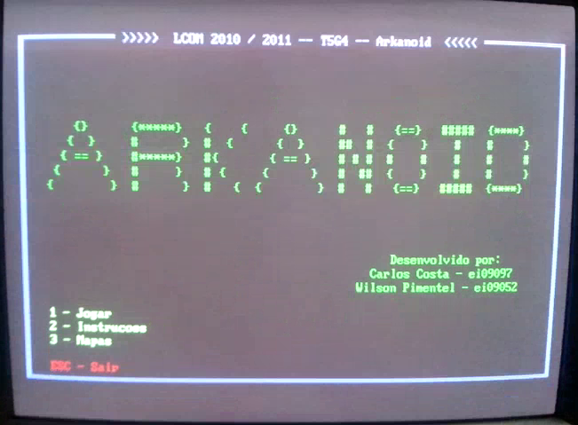
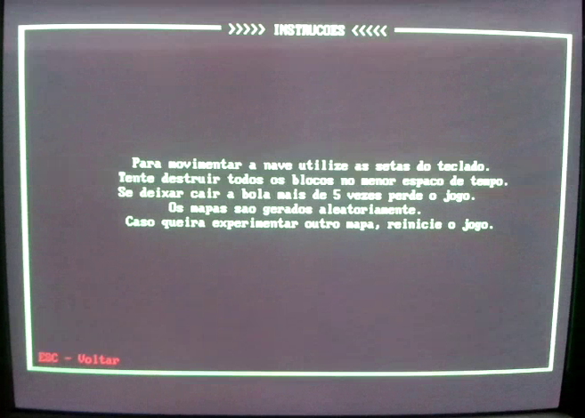
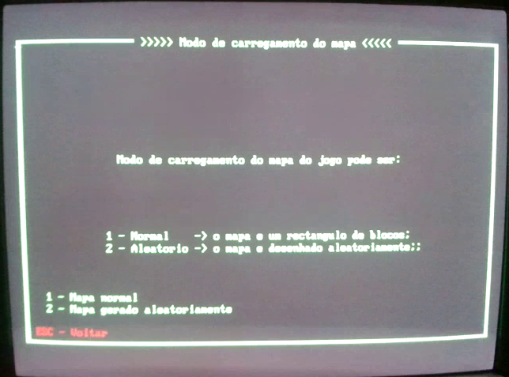
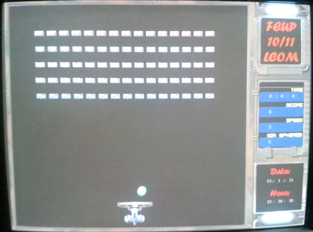
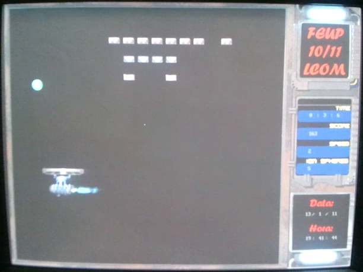
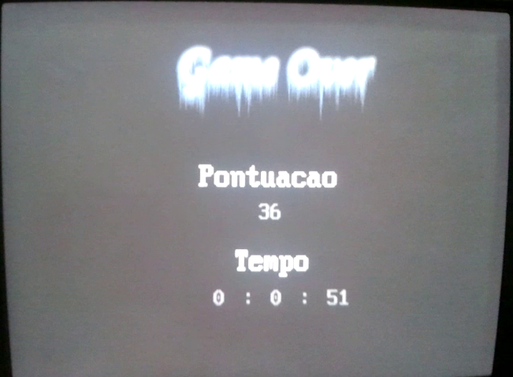

Arkanoid
==================

## Overview

Arcade game implemented using [C](http://www.open-std.org/jtc1/sc22/wg14/), [NASM](http://www.nasm.us/), [DJGPP](http://www.delorie.com/djgpp/) and [DPMI](http://www.delorie.com/djgpp/doc/dpmi/) in Windows 98.

Figure 1: Main menu

Figure 2: Instructions

Figure 3: Game modes

Figure 4: Start of game

Figure 5: Middle of game

Figure 6: Game over
